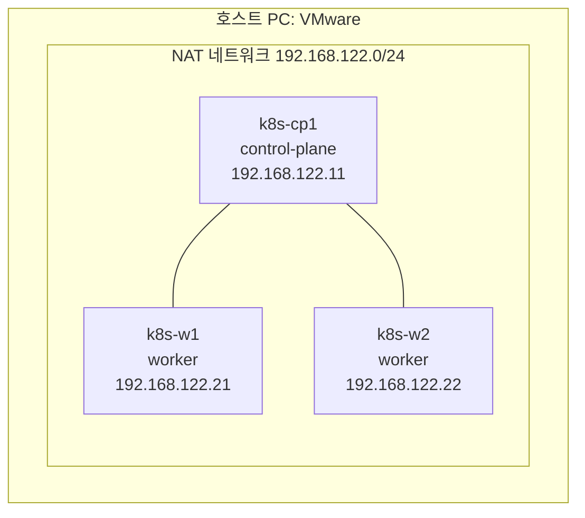

# 온프레미스 가이드: VM 3대 + kubeadm 구축

VM 3대(control-plane 1 + 워커 2)를 만들고 kubeadm으로 쿠버네티스 클러스터를 구성합니다.

| 부분 | 내용 |
|---|---|
| [1부. 구성 개요](#1부-구성-개요) | VM 사양, 네트워크, 런타임·CNI 등 구성 값과 선택 이유 |
| [2부. 구축 가이드](#2부-구축-가이드-a~h) | VM을 만들고 워커 노드를 클러스터에 join하는 실제 순서 (A~H). **직접 따라 할 때는 이쪽부터** |

완료 기준: 노드 3대 Ready, 파드 자동 복구 확인, 워커 장애 시 노드 상태 변화 확인.

---

# 1부. 구성 개요

## 1.1 범위

| 포함 | 제외 |
|---|---|
| VM 3대 생성, 고정 IP, SSH | 백업·복구 |
| containerd, kubeadm/kubelet/kubectl 설치 | CI/CD, 배포 자동화 |
| control-plane 초기화, 워커 노드 join | 애플리케이션(Snipy) 배포 |
| 파드 자동 복구, 워커 장애 확인 | |

## 1.2 구성도



## 1.3 VM 구성

| 항목 | 값 | 비고 |
|---|---|---|
| 가상화 도구 | VMware Workstation Pro (Windows), VMware Fusion (Mac) | 개인 사용 무료(약관은 설치 전 확인) |
| OS | Ubuntu Server 26.04 LTS (amd64) | 이 가이드는 26.04.1(커널 7.0, containerd 2.2.2)에서 검증함. Mac(Apple Silicon)은 arm64 ISO |
| 노드 수 | 3대 (control-plane 1 + worker 2) | |
| 사양 | 각 2 vCPU / 4GB RAM / 30GB 디스크 | 합계 6 vCPU, 12GB. control-plane 최소 요구사항은 2 vCPU·2GB |
| 호스트명 | `k8s-cp1`, `k8s-w1`, `k8s-w2` | |

control-plane이 1대라서 **고가용성은 없습니다.** control-plane이 멈추면 클러스터 관리가 안 됩니다.

## 1.4 네트워크 설계

| 항목 | 값 | 이유 |
|---|---|---|
| VM 네트워크 | VMware NAT(VMnet8), 서브넷 `192.168.122.0/24` | 노드 간 통신과 인터넷(패키지·이미지 다운로드) 모두 필요. 호스트에서도 접속 가능 |
| 노드 IP | cp1 `.11`, w1 `.21`, w2 `.22` (고정) | DHCP 대역 밖에서 고정해 재부팅 후에도 IP가 바뀌지 않게 함 |
| 게이트웨이 | `192.168.122.2` | VMware NAT의 기본 게이트웨이(서브넷의 .2) |
| DNS | `8.8.8.8` 또는 게이트웨이 | |
| Pod CIDR | `10.244.0.0/16` | VM 서브넷(192.168.x.x)과 겹치지 않아야 함. **Calico 기본값(192.168.0.0/16)을 그대로 쓰면 겹침** |
| Service CIDR | `10.96.0.0/12` (kubeadm 기본) | |

**참고:** VMware의 VMnet8 서브넷은 설치 시 자동으로 정해집니다. 이 환경에서는 `192.168.122.0/24`로 잡혀서 그 대역으로 맞췄습니다. VM의 DHCP 범위(`.128` 이상)와 겹치지 않도록 고정 IP는 `.11`, `.21`, `.22`로 정했습니다.

## 1.5 런타임·CNI

### 컨테이너 런타임: containerd
- Kubernetes 1.24부터 dockershim이 제거되어 containerd가 표준입니다. kubeadm 기본 흐름과 맞고, 문서도 가장 많습니다.

### CNI: Calico
| | Calico | Flannel | Cilium |
|---|---|---|---|
| NetworkPolicy | 지원 | **미지원** | 지원 |
| 설치 난이도 | 보통 | 쉬움 | 높음 (커널 요구사항) |
| 리소스 | 보통 | 가벼움 | 무거움 |

NetworkPolicy를 쓸 수 있어서 Flannel 대신 Calico를 선택했습니다.

### 부가 구성요소 (`cp-addons.sh`가 cp1에서 설치)
| 요소 | 용도 |
|---|---|
| metrics-server | `kubectl top` |
| ingress-nginx (NodePort 30080) | 외부 HTTP 진입점 |
| local-path-provisioner | 로컬 디스크 기반 볼륨 자동 생성 |

---

# 2부. 구축 가이드 (A~H)

설계 값(IP, 사양, CNI 등)은 위 1부를 따릅니다.
목표: **노드 3대 Ready**, 파드 자동 복구 확인, 워커 장애 시나리오 맛보기.

## 전체 순서

| 단계 | 어디서 | 무엇을 |
|---|---|---|
| A | 호스트(Windows) | VMware Workstation Pro 설치, 네트워크 서브넷 확인 |
| B | VMware | VM 3대 생성 + Ubuntu 설치 |
| C | 각 VM | 고정 IP 설정, SSH 접속 확인, 스크립트 파일 옮기기 |
| D | 각 VM (root) | `node-common.sh` 실행 |
| E | cp1·워커 (root) | `cp-init.sh` → 워커에서 join → `cp-addons.sh` |
| F | cp1 (root) | 파드 자동 복구·워커 장애 시나리오 확인 |

스크립트(`node-common.sh`, `cp-init.sh`, `cp-addons.sh`)는 이 문서와 같은 `infra/onprem/` 폴더에 있습니다. VM에는 `scp`로 복사합니다 (C단계).

## A. 호스트 준비 (직접 해야 함)

1. **VMware Workstation Pro** 설치: Broadcom 사이트에서 계정을 만들고 내려받습니다. 개인 사용 무료이며 약관은 설치 전에 확인하세요.
2. **Ubuntu Server 26.04 LTS ISO** (amd64) 다운로드: https://ubuntu.com/download/server
3. **네트워크 서브넷 확인:** VMware가 NAT 서브넷을 자동으로 정합니다 (이 환경에서는 `192.168.122.0/24`). 이 값을 그대로 쓰고 바꿀 필요는 없습니다.
   - VM의 DHCP 주소는 보통 `.128`~`.254` 범위에서 배정됩니다. 고정 IP(`.11`, `.21`, `.22`)는 그 범위 밖이라 겹치지 않습니다.
   - 게이트웨이는 보통 서브넷의 `.2`(`192.168.122.2`)입니다. 아래 C단계에서 VM에서 `ip route`로 직접 확인하세요.
   - 서브넷이 다르게 잡힌 PC에서는 1부 1.4절의 IP 표와 스크립트의 `192.168.122.x`를 실제 서브넷으로 바꿔야 합니다.

## B. VM 3대 생성

각각 새 VM을 만들고 (`Create a New Virtual Machine > Typical`):

| VM 이름 | 호스트명 | vCPU | 메모리 | 디스크 | 네트워크 |
|---|---|---|---|---|---|
| k8s-cp1 | k8s-cp1 | 2 | 4GB | 30GB | NAT |
| k8s-w1 | k8s-w1 | 2 | 4GB | 30GB | NAT |
| k8s-w2 | k8s-w2 | 2 | 4GB | 30GB | NAT |

Ubuntu 설치 중 선택:
- 언어 English, 키보드 기본
- 네트워크: 일단 DHCP로 두고 설치 후 고정 IP로 변경 (C단계)
- **Install OpenSSH server** 체크 (필수)
- 사용자: 세 VM 모두 같은 이름·비밀번호를 쓰면 편합니다 (예: `k8s`)

팁: 첫 VM(cp1)을 설치하고 **복제(Clone)**하면 시간이 줄지만, 복제본은 호스트명·MAC·machine-id가 같아서 문제가 생깁니다. 처음에는 3대를 각각 설치하는 것을 권합니다.

## C. 고정 IP와 SSH

각 VM에서 인터페이스 이름 확인 (`ip -br a`, 보통 `ens33` 또는 `ens160`) 후 `/etc/netplan/50-cloud-init.yaml`을 수정합니다. 예시는 cp1(`.11`)이고, w1은 `.21`, w2는 `.22`로 바꿉니다.

```yaml
network:
  version: 2
  ethernets:
    ens33:
      dhcp4: false
      addresses: [192.168.122.11/24]
      routes:
        - to: default
          via: 192.168.122.2
      nameservers:
        addresses: [8.8.8.8, 192.168.122.2]
```

```bash
sudo netplan apply
curl -sI https://pkgs.k8s.io | head -1     # 인터넷 확인 (HTTP 응답 줄이 나오면 정상. 최소 설치 Ubuntu 에는 ping 이 없습니다)
```

### 파일 옮기기 (호스트 → VM, SSH 복사)

**호스트(Git Bash)에서** 레포의 `infra/onprem` 폴더로 이동한 뒤, 아래 파일을 SSH(`scp`)로 VM에 옮겨 주세요. 노드마다 **옮길 파일이 다릅니다.**

| 옮길 파일 | 받는 VM | 이유 |
|---|---|---|
| `node-common.sh` | **cp1, w1, w2 모두 (3대)** | 모든 노드에 같은 기본 설정(swap, containerd, kubeadm)이 필요 |
| `cp-init.sh` | **cp1 한 대만** | 클러스터를 만드는 것은 control-plane 한 대만 함 |
| `cp-addons.sh` | **cp1 한 대만** | metrics-server 등 부가 구성요소도 cp1에서만 설치 |

```bash
cd <레포>/infra/onprem

# 1) node-common.sh 를 3대에 각각 옮긴다
scp node-common.sh k8s@192.168.122.11:~/      # cp1 으로
scp node-common.sh k8s@192.168.122.21:~/      # w1 으로
scp node-common.sh k8s@192.168.122.22:~/      # w2 로

# 2) cp1 에만 나머지 두 파일을 옮긴다
scp cp-init.sh cp-addons.sh k8s@192.168.122.11:~/
```

- 명령마다 SSH 비밀번호를 묻습니다 (총 4번).
- `k8s`는 VM 설치 때 만든 사용자 이름입니다. 다르면 그 이름으로 바꾸세요.
- 도착 확인: 각 VM에 접속해서 `ls ~` 했을 때 위 표의 파일이 보이면 됩니다.

## D. 공통 설정 (3대 모두) — root로 실행

**각 VM에 SSH로 접속한 뒤 `sudo -i`로 root가 되어 실행합니다.** root 셸 안에서는 `sudo`를 붙일 필요가 없고, 한 줄 원격 명령에서 생기는 `sudo: A terminal is required` 문제도 없습니다. 비밀번호는 **SSH 로그인 1회 + `sudo -i` 1회**만 묻습니다.

파일은 C단계에서 `k8s` 계정의 홈(`/home/k8s/`)으로 옮겼으므로, root 셸에서는 `/home/k8s/...` 경로로 실행합니다.

### cp1
```bash
ssh k8s@192.168.122.11                      # 호스트(Git Bash)에서 접속
sudo -i                                     # root 로 전환
bash /home/k8s/node-common.sh k8s-cp1       # 반드시 bash 로 실행 (sh 아님). 호스트명 인자 필수. 노드당 몇 분 걸립니다
```
같은 root 셸에서 바로 확인합니다.
```bash
hostname; which conntrack; grep -c "SystemdCgroup = true" /etc/containerd/config.toml; swapon --show | wc -l; kubeadm version -o short
exit                                        # root 에서 나옴
exit                                        # SSH 종료
```

### w1
```bash
ssh k8s@192.168.122.21
sudo -i
bash /home/k8s/node-common.sh k8s-w1
hostname; which conntrack; grep -c "SystemdCgroup = true" /etc/containerd/config.toml; swapon --show | wc -l; kubeadm version -o short
exit
exit
```

### w2
```bash
ssh k8s@192.168.122.22
sudo -i
bash /home/k8s/node-common.sh k8s-w2
hostname; which conntrack; grep -c "SystemdCgroup = true" /etc/containerd/config.toml; swapon --show | wc -l; kubeadm version -o short
exit
exit
```

- 성공 신호: `node-common.sh` 마지막 줄에 `containerd: ...  kubeadm: v1.31.x  swap: 0줄(0이어야 함)`
- 확인 명령에서 **호스트명, `conntrack` 경로, `1`, `0`, `v1.31.x`**가 나와야 합니다.
- 스크립트는 여러 번 실행해도 안전합니다. 수정했다면 `scp`로 다시 복사해서 같은 방식으로 재실행하세요.
- 설치되는 것: containerd, kubeadm/kubelet/kubectl, 그리고 kubeadm 사전 점검에 필요한 `conntrack`, `socat`, `ebtables`, `ethtool`
- 3대가 모두 끝나면 **VMware 스냅샷**(`after-node-common`)을 찍어 두세요.

## E. 클러스터 구성 — root로 실행

### E-1. control-plane 초기화 (cp1에서만)
```bash
ssh k8s@192.168.122.11
sudo -i
bash /home/k8s/cp-init.sh        # 5~10분. 마지막에 출력되는 'kubeadm join ...' 명령을 통째로 복사해 두세요
```
- root로 실행하면 `kubectl` 설정이 `/root/.kube/config`에 자동으로 만들어져, 이후 같은 root 셸에서 `kubectl`을 바로 쓸 수 있습니다.
- 이 셸(cp1, root)은 E-3에서 다시 쓰니 **닫지 말고 두세요.**

### E-2. 워커 join (w1, w2 각각)
복사해 둔 `kubeadm join` 명령을 **그대로** 실행합니다. root라서 `sudo`는 필요 없습니다.

**w1**
```bash
ssh k8s@192.168.122.21
sudo -i
kubeadm join 192.168.122.11:6443 --token <토큰> --discovery-token-ca-cert-hash sha256:<해시>
exit
exit
```

**w2**
```bash
ssh k8s@192.168.122.22
sudo -i
kubeadm join 192.168.122.11:6443 --token <토큰> --discovery-token-ca-cert-hash sha256:<해시>
exit
exit
```
`This node has joined the cluster`가 나오면 성공입니다.

### E-3. 노드 확인과 부가 구성요소 (cp1, root)
```bash
kubectl get nodes                # 3개가 모두 Ready 가 될 때까지 (1~3분)
bash /home/k8s/cp-addons.sh      # metrics-server, ingress-nginx, local-path
kubectl top nodes                # CPU/메모리 수치가 나오면 정상
```

## F. 클러스터 동작 확인 (cp1, root)

노드 3대가 Ready가 된 뒤, 클러스터가 실제로 **파드를 분산하고, 죽은 파드를 되살리고, 노드 장애를 감지**하는지 확인합니다. cp1의 root 셸에서 진행합니다.

### F-1. `kubectl` 확인
E에서 root로 `cp-init.sh`를 실행했다면 **별도 준비가 필요 없습니다.**
```bash
kubectl get nodes                # 3개 모두 Ready
```
`/root/.kube/config`에는 **클러스터 관리자 권한**이 들어 있습니다. 외부로 복사하거나 공유하지 마세요.
(선택) `k8s` 일반 계정에서도 `kubectl`을 쓰고 싶다면 root 셸에서 `mkdir -p /home/k8s/.kube && cp /etc/kubernetes/admin.conf /home/k8s/.kube/config && chown k8s:k8s /home/k8s/.kube/config`를 실행하세요.

### F-2. 파드 자동 복구 확인
```bash
kubectl create deploy web --image=nginx --replicas=3
kubectl get pods -o wide                      # 워커 w1, w2 에 나뉘어 배치되는지 (control-plane 에는 안 올라감)
kubectl delete pod -l app=web --wait=false
kubectl get pods -w                           # 지운 만큼 새 파드가 자동으로 생기는지 (Ctrl+C 로 종료)
kubectl delete deploy web                     # 정리
```
- 정상: 파드 3개가 워커 두 대에 분산되고, 지워도 몇 초 안에 새 파드 3개가 `Running`이 됩니다.

### F-3. 워커 장애 시나리오
워커 한 대의 `kubelet`을 멈춰서 노드 장애를 흉내 냅니다. **터미널을 두 개** 씁니다.

**터미널 1 (cp1, root)** — 노드 상태를 계속 관찰
```bash
kubectl get nodes -w
```

**터미널 2 (w2, root)** — kubelet 중지 후 되돌리기
```bash
ssh k8s@192.168.122.22
sudo -i
systemctl stop kubelet           # 이 시각을 기록
# ... 터미널 1에서 w2 가 NotReady 로 바뀌는 시각을 기록 ...
systemctl start kubelet          # 원래대로 되돌리기
```
- 기록할 것: ① `stop` 한 시각 ② w2가 `NotReady`로 표시된 시각 ③ `start` 후 `Ready`로 돌아온 시각.
- 참고: 쿠버네티스 기본값으로는 노드가 응답을 멈춘 뒤 약 40초 후 `NotReady`로 표시되고, 그 노드의 파드는 기본 5분 뒤에 다른 노드로 옮겨집니다 (공식 문서 기준, 직접 측정해서 확인해 보세요).

## G. 문제 해결

| 증상 | 원인 | 해결 |
|---|---|---|
| `kubeadm init` 이 preflight 에서 실패 (swap) | swap 이 켜져 있음 | `node-common.sh` 재실행, `swapon --show` 로 확인 |
| `sudo: A terminal is required to authenticate` | 한 줄 원격 명령에 터미널이 없음 | 접속한 뒤 `sudo -i`로 root 셸에서 실행 (또는 `ssh -t` 사용) |
| `[ERROR FileExisting-conntrack]: conntrack not found` | `conntrack` 패키지 미설치 (이전 버전 스크립트) | 최신 `node-common.sh` 를 다시 복사해 3대에서 재실행 |
| `E: Could not get lock /var/lib/dpkg/lock-frontend ... held by process ... (unattended-upgr)` | 자동 업데이트가 apt 를 잡고 있음 (VM 을 켠 직후에 흔함) | `node-common.sh` 는 최대 10분 자동 대기합니다. 직접 기다리려면 `while pgrep -x unattended-upgr >/dev/null; do sleep 5; done` 후 재실행 |
| 노드가 계속 NotReady | CNI(Calico) 미기동 | `kubectl -n calico-system get pods`, Pod CIDR 이 `10.244.0.0/16` 인지 확인 |
| Calico 파드 CrashLoop | Pod CIDR 이 VM 서브넷과 겹침 | `cp-init.sh` 의 CIDR 확인 (기본값 192.168.0.0/16 사용 금지) |
| 파드가 계속 재시작 | containerd 의 `SystemdCgroup` 가 false | `grep SystemdCgroup /etc/containerd/config.toml` |
| `kubectl top` 실패 | metrics-server 인증서 검증 | `cp-addons.sh` 가 `--kubelet-insecure-tls` 를 붙입니다 |
| VM 재부팅 후 IP 변경 | DHCP 로 돌아감 | netplan 의 고정 IP 설정 확인 |
| 호스트에서 VM 접속 안 됨 | VMnet8 서브넷 불일치 | Virtual Network Editor 의 서브넷 확인 |
| 토큰 만료 (join 실패) | 기본 24시간 | cp1 에서 `kubeadm token create --print-join-command` |
| `kubectl` 이 `localhost:8080` 으로 접속 시도 | root 가 아닌 계정에서 실행했거나 kubeconfig 가 없음 | cp1 에서 `sudo -i` 로 root 셸에서 실행하거나, F-1 의 (선택) 복사 명령 사용 |

## H. 정리·재설정

```bash
# 노드 초기화 (VM 은 유지하고 클러스터만 지우기)
sudo kubeadm reset -f && sudo rm -rf /etc/cni/net.d ~/.kube
```

VM 스냅샷을 `node-common.sh` 실행 직후에 찍어 두면, 클러스터 구성을 망쳤을 때 그 시점으로 바로 되돌릴 수 있습니다.
